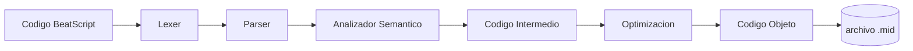

Materia: Lenguajes y Automatas II
Docente: Parra Urias Ma. Elena
Integrantes del Equipo:
- Altamirano Plantillas Eddie David
- Rendón Vazquez Karime Lizbeth
- Alam Israel Santos Fletes
- Rodriguez Flores Iker Gustavo

Nombre del proyecto:
# BeatScript

**Tu código, tu sinfonía**


BeatScript es un compilador para un lenguaje de dominio específico (DSL) pensado para componer música:
traduce código fuente legible por humanos directamente a un archivo .mid reproducible, 
sin pasar por ningún DAW ni notación musical tradicional.

El proyecto se desarrolló a lo largo de dos materias consecutivas. En Lenguajes y Autómatas I 
se completó hasta el análisis léxico y el análisis sintáctico. En Lenguajes y Autómatas II (materia actual) 
ya está desarrollado el análisis semántico y el código intermedio, quedan pendientes la optimización de código y
la generación de código objeto.

## Estado del proyecto

| Materia                  | Etapas cubiertas |
|---|---|
| Lenguajes y Autómatas I  | Análisis léxico, análisis sintáctico |
| Lenguajes y Autómatas II | Análisis semántico (completado), Código Intermedio (completado). Pendiente: optimización de código, código objeto |

## Características

- Editor propio con resaltado de sintaxis en tiempo real, numeración de línea y soporte multi-pestaña.
- Compilar y reproducir con un clic: genera el .mid y lo reproduce de inmediato.
- Árbol de derivación visual (Graphviz) además del AST en texto plano.
- Sistema de errores en tres niveles — léxico, sintáctico y semántico — con sugerencias tipo "¿quisiste decir...?" para palabras mal escritas.
- Acordes, repeticiones, transposición y acentos, con alcance de bloque correctamente delimitado.
- Pistas en paralelo o en secuencia: varios instrumentos sonando a la vez, o secciones que se ejecutan una tras otra, controlado desde el propio código fuente.

## Ejemplo rápido

```beatscript
tempo 110
volume 80
instrument violin

track melodia {
    E4 negra
    E4 negra
    F4 negra
    G4 negra
    G4 negra
    F4 negra
    E4 negra
    D4 negra
    C4 negra
    C4 negra
    D4 negra
    E4 negra
    E4 blanca
    D4 blanca
}
```

Dos tracks pueden sonar en paralelo o en secuencia según cómo se declaren:

```beatscript
track melodia { instrument violin  C4 negra  E4 negra }
track bajo    { instrument cello   C3 blanca }

secuencia {
    (melodia, bajo),
    melodia
}
```

## Arquitectura del compilador



| Etapa | Módulo | Entrada / Salida | Estado |
|---|---|---|---|
| 1. Léxico | `lexer.py` | código fuente a tokens | Completado |
| 2. Sintáctico | `parser.py` | tokens a AST | Completado |
| 3. Semántico | `semantic.py` | AST a errores / advertencias | Completado |
| 4. Código intermedio | — | AST a representación intermedia | Pendiente |
| 5. Optimización | — | código intermedio optimizado | Pendiente |
| 6. Código objeto | — | código intermedio a salida final | Pendiente |
## Instalación

Requiere Python 3.9 o superior.

```bash
pip install ply midiutil customtkinter pygame graphviz
```

El árbol de derivación visual necesita además el binario de Graphviz 
(https://graphviz.org/download/) instalado en el sistema, no solo el paquete de Python, agregado al PATH.

## Uso

```bash
python main_gui.py
```

Esto abre el IDE. Escribe o abre un archivo `.bs`, presiona "Compilar y Reproducir", 
y si el código no tiene errores se genera `output.mid` y se reproduce automáticamente.

## Referencia del lenguaje

| Instrucción | Descripción |
|---|---|
| `tempo N` | Velocidad en BPM (20-300) |
| `volume N` | Volumen / velocity MIDI (0-127); global o dentro de un track |
| `pan N` | Paneo estéreo (0 = izquierda, 127 = derecha) |
| `compas N M` | Métrica del compás (M debe ser potencia de 2) |
| `instrument NOMBRE` | Instrumento General MIDI (`piano`, `violin`, `guitar`, `trumpet`, `drums`, etc.) |
| `track NOMBRE { }` | Declara una pista con nombre |
| `NOTA DURACION` | Nota musical, ej. `C4 negra`, `D#3 corchea`, `Eb5 blanca` |
| `rest DURACION` | Silencio |
| `chord { NOTA+ DURACION }` | Acorde: varias notas simultáneas |
| `repeat N { }` | Repite el bloque N veces |
| `transpose N { }` | Transpone N semitonos (solo dentro del bloque) |
| `acento [N] { }` | Sube el volumen del bloque (valor explícito o +20 automático) |
| `secuencia { (a,b), c }` | Grupos entre paréntesis suenan en paralelo; separados por coma, en secuencia |

Duraciones válidas: `redonda`, `blanca`, `negra`, `corchea`, `semicorchea`, `fusa`, `semifusa`, y su variante con puntillo agregando `_punto` (ej. `negra_punto`).
Duraciones válidas: `redonda`, `blanca`, `negra`, `corchea`, `semicorchea`, `fusa`, `semifusa`, 
y su variante con puntillo agregando `_punto` (ej. `negra_punto`).

## Manejo de errores

BeatScript reporta problemas en tres niveles, cada uno con línea (y columna, cuando aplica), por ejemplo:
```
[ERROR LEXICO] Linea 4, Col 12: caracter ilegal '@'
[ERROR SINTACTICO] Linea 7, Col 3: se esperaba '{'
[ERROR SEMANTICO #02] Linea 9: volume 200 fuera del rango MIDI valido (0-127)
```

Los errores léxicos y sintácticos detienen la compilación. Las advertencias semánticas se 
muestran pero permiten compilar; los errores semánticos sí la detienen. El catálogo completo de 
errores está disponible dentro del propio IDE, en el botón "Catálogo de Errores".

## Estructura del proyecto

```
beatscript2/
├── main_gui.py          (IDE: interfaz grafica, orquesta el pipeline)
└── beatscript/
    ├── __init__.py
    ├── lexer.py          (Etapa 1 - analisis lexico, PLY)
    ├── parser.py         (Etapa 2 - parser recursivo descendente + AST)
    ├── semantic.py       (Etapa 3 - analisis semantico, dos pasadas)
    └── midi_gen.py       (generacion del archivo .mid)
    └── tac_gen.py       (generacion del código de 3 direcciones)
```


## ¿Cómo está organizado el TAC en BeatScript?

Cada **pista** (`track`) del programa BeatScript se traduce en su propia
**rutina** de TAC, totalmente independiente de las demás, con su propio
conjunto de variables temporales y etiquetas (todas con un prefijo único,
el nombre de la pista, para que no se mezclen entre sí). Esto refleja el
hecho de que, musicalmente, las pistas suenan en paralelo: la pista de
piano y la pista de batería no comparten "tiempo de ejecución", así que no
tiene sentido que compartan una sola rutina de código.

Además existe una **rutina global** (el "prólogo"), que solo contiene las
instrucciones de tempo que aparecen fuera de cualquier pista, y una **tabla
de horarios** (*schedule*) que resuelve los bloques de `secuencia`: cuando
una pista debe sonar después de otra (en vez de sonar desde el segundo 0),
ese punto de arranque se calcula como una constante desde antes de generar
el TAC, sumando la duración total de los eventos que la preceden.

Una decisión importante de diseño es que **no se optimiza nada en esta
etapa**: si una nota es un "Do sostenido en la octava 4", el programa no
calcula el número MIDI de una vez — genera instrucciones explícitas que
suman semitonos, multiplican por la octava, etc. Esto es intencional: el
TAC debe reflejar fielmente cada operación tal como aparece en el
código fuente, y cualquier optimización (como "plegado de constantes") le
correspondería a una fase posterior que en este punto aún no implementa.

---
## Tabla de métodos generadores (dentro de `TACGenerator`)

Estos son los métodos de Python que **construyen** el TAC recorriendo el
árbol sintáctico. No son instrucciones del TAC en sí — son la maquinaria
que va emitiendo esas instrucciones a medida que recorre el programa.

| Método | Qué es | Para qué sirve |
|---|---|---|
| `generate()` | Punto de entrada del generador | Recorre las instrucciones de nivel superior del programa (tempo, instrumento, volumen, pan, pistas, secuencias) y produce el prólogo, la lista de rutinas y la tabla de horarios. |
| `_build_schedule(sequences)` | Calculador de horarios | Determina en qué momento (en beats) debe empezar cada pista, según los bloques `secuencia`; las pistas fuera de una secuencia arrancan en el tiempo 0. |
| `_generate_track(node, defaults)` | Generador de una pista completa | Crea la rutina de una pista: inicializa sus variables (tiempo, velocidad, instrumento, pan, transposición) y luego recorre todos sus eventos musicales uno por uno. |
| `_gen_event(r, node, ctx)` | Despachador de eventos | Revisa de qué tipo es cada evento musical (nota, silencio, acorde, repetición, transposición, acento, cambio de volumen/pan/instrumento) y llama al método específico que le corresponde. |
| `_gen_pitch(r, pitch_str, ctx)` | Calculador de altura (pitch) | Traduce una nota escrita como texto (por ejemplo `"C#4"`) a las instrucciones de TAC que calculan su número MIDI, paso por paso: octava, alteración (sostenido/bemol) y transposición. |
| `_gen_note(r, node, ctx)` | Generador de nota | Emite las instrucciones necesarias para tocar una sola nota: calcula su pitch, arma la llamada a `emit_note` y avanza el reloj interno de la pista. |
| `_gen_rest(r, node, ctx)` | Generador de silencio | No produce ningún sonido; solo avanza el reloj interno de la pista la duración del silencio. |
| `_gen_chord(r, node, ctx)` | Generador de acorde | Igual que una nota, pero repite el proceso para cada nota del acorde (todas suenan al mismo tiempo) y avanza el reloj una sola vez al final. |
| `_gen_repeat(r, node, ctx)` | Generador de repetición | Traduce un bloque `repetir` en un verdadero ciclo de bajo nivel: una variable contador, una etiqueta de inicio, una comparación y un salto condicional — igual que un `for` traducido "a mano". |
| `_gen_transpose(r, node, ctx)` | Generador de transposición | Suma temporalmente los semitonos indicados a la variable de transposición de la pista, genera los eventos internos, y al terminar resta esa misma cantidad para restaurar el valor original. |
| `_gen_accent(r, node, ctx)` | Generador de acento | Guarda la velocidad (volumen de golpe) actual, la sube (o la fija a un valor explícito) mientras se generan los eventos internos, y al terminar la restaura al valor guardado. |

---

## Tabla de funciones de biblioteca (las que sí "suenan")

El TAC por sí solo no produce audio: es una receta de instrucciones. Las
que realmente tienen efecto sobre un archivo MIDI son estas cuatro
funciones, invocadas siempre mediante la instrucción `CALL` (ver la tabla
de abajo).

| Función | Qué es | Para qué sirve |
|---|---|---|
| `emit_note(pitch, dur, vel, chan, time)` | Emisor de nota MIDI | Escribe una nota real: qué tono suena (`pitch`), cuánto dura (`dur`), con qué fuerza (`vel`, velocity), en qué pista/canal (`chan`) y en qué momento exacto (`time`). |
| `set_tempo(bpm, time)` | Fijador de tempo | Establece la velocidad de reproducción (beats por minuto) a partir de cierto momento de la pieza. |
| `set_program(prog, chan, time)` | Selector de instrumento | Define qué instrumento (por ejemplo piano, violín, batería) usará ese canal a partir de ese momento. |
| `set_pan(pan, chan, time)` | Fijador de panorámica | Define hacia qué lado del estéreo (izquierda/derecha) se escucha ese canal, a partir de ese momento. |

---

## Tabla de instrucciones tipo "ensamblador" (los operadores del TAC)

Cada cuádruplo generado tiene la forma `(operador, arg1, arg2, resultado)`.
Estos son todos los operadores que BeatScript utiliza y qué representan:

| Instrucción | Significado | Uso en BeatScript |
|---|---|---|
| `MOV dst, src` | `dst = src` (copiar un valor) | Se usa para inicializar variables al empezar una pista (tiempo en 0, volumen por defecto, etc.) y para restaurar valores después de un acento o una transposición. |
| `ADD dst, a, b` | `dst = a + b` | Se usa para sumar semitonos al calcular el pitch de una nota, para avanzar el reloj de la pista después de cada nota o silencio, y para incrementar el contador de un ciclo `repetir`. |
| `SUB dst, a, b` | `dst = a - b` | Se usa, por ejemplo, para bajar un semitono cuando una nota lleva bemol, o para deshacer una transposición temporal al salir de un bloque `transponer`. |
| `MUL dst, a, b` | `dst = a * b` | Se usa al calcular el pitch: multiplica el número de octava por 12 (los semitonos que tiene cada octava). |
| `MIN dst, a, b` | `dst = min(a, b)` | Se usa al aplicar un acento automático, para que la velocidad nunca pase de 127 (el máximo permitido por el estándar MIDI). |
| `LT dst, a, b` | `dst = (a < b)` (comparación "menor que") | Se usa como condición de los ciclos `repetir`: mientras el contador sea menor que el número de repeticiones, el ciclo continúa. |
| `LABEL L` | Marca un punto del código con el nombre `L` | Se usa para señalar el inicio del cuerpo de un ciclo `repetir` y el punto donde termina, de modo que los saltos (`GOTO`/`IFFALSE`) sepan a dónde llegar. |
| `GOTO L` | Salta incondicionalmente a la etiqueta `L` | Cierra el ciclo: al final de cada vuelta, regresa a evaluar otra vez la condición del `repetir`. |
| `IFFALSE cond, L` | Si `cond` es falsa, salta a `L` | Es la salida del ciclo: en cuanto la condición deja de cumplirse, se abandona el `repetir` y se continúa después de él. |
| `PARAM x` | Apila `x` como argumento de la siguiente llamada | Se usa antes de cada `CALL`, para ir acumulando los parámetros (pitch, duración, canal, tiempo, etc.) que la función necesita. |
| `CALL f, n` | Llama a la función `f` usando los últimos `n` valores apilados con `PARAM` | Es la instrucción que "hace algo real": llama a `emit_note`, `set_tempo`, `set_program` o `set_pan`. |

---

## Anatomía de una rutina real: variables de arranque

Al abrir la rutina de una pista cualquiera — en este ejemplo, una pista
llamada `melodia` — lo primero que aparece siempre son las mismas cinco
líneas de inicialización, prefijadas con el nombre de la pista:
melodia_t = 0.0  
melodia_vel = 80  
melodia_prog = 40  
melodia_pan = 64  
melodia_transp = 0
| Variable | Significado | Valor inicial típico |
|---|---|---|
| `melodia_t` | El reloj interno de la pista: en qué beat va sonando en este momento | `0.0` (arranca en el tiempo cero) |
| `melodia_vel` | La velocidad (fuerza del golpe / volumen de cada nota) | `80` por defecto, o el valor indicado con `volumen` |
| `melodia_prog` | El número de instrumento MIDI que usará esta pista | El que corresponda al `instrumento` declarado (aquí, `40` = violín) |
| `melodia_pan` | La posición estéreo (izquierda/derecha) de la pista | `64` por defecto (centrado) |
| `melodia_transp` | Cuántos semitonos se están sumando/restando a todas las notas en este momento | `0` (sin transposición) |

Justo después, **toda rutina, sin excepción**, emite dos llamadas antes de
tocar la primera nota — le avisan al reproductor con qué instrumento y en
qué posición estéreo va a sonar esta pista desde el inicio:
param melodia_prog  
param 0  
param melodia_t  
call set_program, 3

param melodia_pan  
param 0  
param melodia_t  
call set_pan, 3

### ¿Qué es ese `0` que se repite en cada `param`?

Es el **canal MIDI** (`chan`), y en esta etapa del compilador es siempre
una constante fija (`chan_const = 0`) para toda la rutina — cada pista, al
generar su propio TAC, "piensa" que es la única y usa el canal `0`. La
asignación de canales distintos, necesaria para que varias pistas suenen
juntas sin pisarse, ocurre después, en otra etapa del proyecto que arma el
archivo MIDI final (y que, como se explica más abajo, no depende del TAC).

---

## Cómo se calcula el pitch de una nota, con un ejemplo real

Tomemos la primera nota de la pista `melodia` del ejemplo: una **E4** de duración negra. El generador no escribe directamente "pitch 64" — produce esta cadena de instrucciones:
**melodia_oct1** = 4 + 1 // octava (4) + 1  
**melodia_mul1** = melodia_oct1 * 12 // semitonos que aporta la octava  
**melodia_pitch1** = 4 + melodia_mul1 // 4 = semitono base de la letra "E"  
**melodia_pitch2** = melodia_pitch1 + melodia_transp // se aplica la transposición vigente  
param melodia_pitch2  
param 1.0 // duración de una negra, en beats  
param melodia_vel  
param 0  
param melodia_t  
call emit_note, 5  
melodia_t = melodia_t + 1.0 // el reloj de la pista avanza
Si la nota llevara alteración (por ejemplo, un `C#4`), aparecería un paso
extra entre el cálculo del pitch base y la transposición:
t_pitch = t_pitch + 1 // el sostenido suma un semitono adicional
y si llevara bemol, sería un `SUB` en vez de un `ADD`. Como en este ejemplo
la nota no lleva alteración, ese paso simplemente no aparece — el
generador solo emite las instrucciones que realmente corresponden a lo
que se escribió en el código fuente.

### ¿Por qué aparecen números sueltos si "no se pliega nada"?

Es una distinción importante: **"no plegar constantes" no significa que no haya números en el TAC** — significa que no se precalculan las
*operaciones entre esos números*.

Un valor como el semitono base de una letra (`E` = 4) o el número de una octava (`4`) **no se calcula**, viene ya escrito tal cual en el código
fuente (`E4`) — por eso aparece como literal directo en el TAC. Lo que el
generador se niega a hacer es resolver la aritmética por adelantado — no
escribe directamente `melodia_pitch1 = 64`, aunque matemáticamente ya conocería el resultado. Cada suma y cada multiplicación se deja como una instrucción separada, tal como pediría un compilador real que todavía no ha llegado a su fase de optimización.

Lo mismo pasa con la duración de la nota (`param 1.0` para una negra,
`param 2.0` para una blanca): es un literal que viene directo de la tabla
de duraciones del lenguaje, no algo calculado.

### Por qué los temporales de "pitch" no se reinician en cada nota

Fíjate en la numeración a lo largo de la rutina: la primera nota usa
`melodia_pitch1` y `melodia_pitch2`; la segunda nota, en vez de reiniciar en `pitch1`, sigue en `melodia_pitch3` y `melodia_pitch4`; la tercera en `pitch5` y `pitch6`, y así sucesivamente durante toda la pista.

Esto es porque el generador usa un solo contador compartido por prefijo (`pitch`, `oct`, `mul`, etc.) para **toda la rutina**, no uno nuevo por cada nota. Cada vez que se necesita un nombre de temporal nuevo, el contador avanza y nunca se repite — así se garantiza que ninguna variable temporal se reutilice por accidente entre dos notas distintas, aunque ambas hagan literalmente el mismo tipo de cálculo.

---

## Importante: el TAC no es lo que se ejecuta para producir el sonido

Es tentador pensar que, una vez generado el TAC, el programa simplemente lo "ejecuta" instrucción por instrucción para producir el archivo MIDI como si fuera un mini-intérprete. **No es así.**

Lo que en realidad ocurre al compilar un programa BeatScript es:

1. Se genera el AST (árbol sintáctico) del programa.
2. **Por un lado**, se genera el TAC a partir de ese AST y se muestra en
   pantalla (pestañas de Código / Cuádruplos / Tripletas) — como una
   representación pedagógica de esta etapa de la compilación.
3. **Por otro lado, de forma completamente independiente**, se genera el
   archivo `.mid` real directamente a partir de los *tokens* originales
   producidos por el analizador léxico, sin pasar por el TAC en absoluto.

Es decir: en este proyecto, el TAC se genera y se muestra para **ilustrar**cómo luce esta etapa en un compilador real, pero el sonido que finalmente se escucha no proviene de "ejecutar" esas instrucciones de tresdirecciones proviene de un camino aparte que interpreta los tokens directamente.

---

## Conclusión

El TAC en BeatScript funciona como una traducción intermedia y muy
explícita del programa musical: convierte conceptos de alto nivel (notas,
acordes, repeticiones, acentos, transposiciones) en una secuencia lineal de operaciones simples de aritmética, comparación, salto y llamada a función,organizadas en rutinas independientes una por pista más una tabla dehorarios que decide cuándo arranca cada una.

Esta representación no produce sonido por sí sola ni es, en este proyecto, la que efectivamente se interpreta para generar el audio: su valor es mostrar, de forma clara y explícita, cómo se ve un programa musical de alto nivel una vez descompuesto en los pasos mínimos e indivisibles que tradicionalmente usa un compilador entre el análisis del código fuente y la generación del código final.
