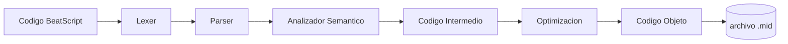

Materia: Lenguajes y Automatas II
Docente: Parra Urias Ma. Elena
Integrantes del Equipo:
- Altamirano Plantillas Eddie David
- Rendón Vazquez Karime Lizbeth
- Alam Israel Santos Fletes
- Rodriguez Flores Iker Gustavo

Nombre del proyecto:
# BeatScript

**Tu código, tu sinfonía**


BeatScript es un compilador para un lenguaje de dominio específico (DSL) pensado para componer música:
traduce código fuente legible por humanos directamente a un archivo .mid reproducible, 
sin pasar por ningún DAW ni notación musical tradicional.

El proyecto se desarrolló a lo largo de dos materias consecutivas. En Lenguajes y Autómatas I 
se completó hasta el análisis léxico y el análisis sintáctico. En Lenguajes y Autómatas II (materia actual) 
ya está desarrollado el análisis semántico, y quedan pendientes el código intermedio, la optimización de código y
la generación de código objeto.

## Estado del proyecto

| Materia                  | Etapas cubiertas |
|---|---|
| Lenguajes y Autómatas I  | Análisis léxico, análisis sintáctico |
| Lenguajes y Autómatas II | Análisis semántico (completado). Pendiente: código intermedio, optimización de código, código objeto |

## Características

- Editor propio con resaltado de sintaxis en tiempo real, numeración de línea y soporte multi-pestaña.
- Compilar y reproducir con un clic: genera el .mid y lo reproduce de inmediato.
- Árbol de derivación visual (Graphviz) además del AST en texto plano.
- Sistema de errores en tres niveles — léxico, sintáctico y semántico — con sugerencias tipo "¿quisiste decir...?" para palabras mal escritas.
- Acordes, repeticiones, transposición y acentos, con alcance de bloque correctamente delimitado.
- Pistas en paralelo o en secuencia: varios instrumentos sonando a la vez, o secciones que se ejecutan una tras otra, controlado desde el propio código fuente.

## Ejemplo rápido

```beatscript
tempo 110
volume 80
instrument violin

track melodia {
    E4 negra
    E4 negra
    F4 negra
    G4 negra
    G4 negra
    F4 negra
    E4 negra
    D4 negra
    C4 negra
    C4 negra
    D4 negra
    E4 negra
    E4 blanca
    D4 blanca
}
```

Dos tracks pueden sonar en paralelo o en secuencia según cómo se declaren:

```beatscript
track melodia { instrument violin  C4 negra  E4 negra }
track bajo    { instrument cello   C3 blanca }

secuencia {
    (melodia, bajo),
    melodia
}
```

## Arquitectura del compilador



| Etapa | Módulo | Entrada / Salida | Estado |
|---|---|---|---|
| 1. Léxico | `lexer.py` | código fuente a tokens | Completado |
| 2. Sintáctico | `parser.py` | tokens a AST | Completado |
| 3. Semántico | `semantic.py` | AST a errores / advertencias | Completado |
| 4. Código intermedio | — | AST a representación intermedia | Pendiente |
| 5. Optimización | — | código intermedio optimizado | Pendiente |
| 6. Código objeto | — | código intermedio a salida final | Pendiente |
## Instalación

Requiere Python 3.9 o superior.

```bash
pip install ply midiutil customtkinter pygame graphviz
```

El árbol de derivación visual necesita además el binario de Graphviz 
(https://graphviz.org/download/) instalado en el sistema, no solo el paquete de Python, agregado al PATH.

## Uso

```bash
python main_gui.py
```

Esto abre el IDE. Escribe o abre un archivo `.bs`, presiona "Compilar y Reproducir", 
y si el código no tiene errores se genera `output.mid` y se reproduce automáticamente.

## Referencia del lenguaje

| Instrucción | Descripción |
|---|---|
| `tempo N` | Velocidad en BPM (20-300) |
| `volume N` | Volumen / velocity MIDI (0-127); global o dentro de un track |
| `pan N` | Paneo estéreo (0 = izquierda, 127 = derecha) |
| `compas N M` | Métrica del compás (M debe ser potencia de 2) |
| `instrument NOMBRE` | Instrumento General MIDI (`piano`, `violin`, `guitar`, `trumpet`, `drums`, etc.) |
| `track NOMBRE { }` | Declara una pista con nombre |
| `NOTA DURACION` | Nota musical, ej. `C4 negra`, `D#3 corchea`, `Eb5 blanca` |
| `rest DURACION` | Silencio |
| `chord { NOTA+ DURACION }` | Acorde: varias notas simultáneas |
| `repeat N { }` | Repite el bloque N veces |
| `transpose N { }` | Transpone N semitonos (solo dentro del bloque) |
| `acento [N] { }` | Sube el volumen del bloque (valor explícito o +20 automático) |
| `secuencia { (a,b), c }` | Grupos entre paréntesis suenan en paralelo; separados por coma, en secuencia |

Duraciones válidas: `redonda`, `blanca`, `negra`, `corchea`, `semicorchea`, `fusa`, `semifusa`, y su variante con puntillo agregando `_punto` (ej. `negra_punto`).
Duraciones válidas: `redonda`, `blanca`, `negra`, `corchea`, `semicorchea`, `fusa`, `semifusa`, 
y su variante con puntillo agregando `_punto` (ej. `negra_punto`).

## Manejo de errores

BeatScript reporta problemas en tres niveles, cada uno con línea (y columna, cuando aplica), por ejemplo:
```
[ERROR LEXICO] Linea 4, Col 12: caracter ilegal '@'
[ERROR SINTACTICO] Linea 7, Col 3: se esperaba '{'
[ERROR SEMANTICO #02] Linea 9: volume 200 fuera del rango MIDI valido (0-127)
```

Los errores léxicos y sintácticos detienen la compilación. Las advertencias semánticas se 
muestran pero permiten compilar; los errores semánticos sí la detienen. El catálogo completo de 
errores está disponible dentro del propio IDE, en el botón "Catálogo de Errores".

## Estructura del proyecto

```
beatscript2/
├── main_gui.py          (IDE: interfaz grafica, orquesta el pipeline)
└── beatscript/
    ├── __init__.py
    ├── lexer.py          (Etapa 1 - analisis lexico, PLY)
    ├── parser.py         (Etapa 2 - parser recursivo descendente + AST)
    ├── semantic.py       (Etapa 3 - analisis semantico, dos pasadas)
    └── midi_gen.py       (generacion del archivo .mid)
```
